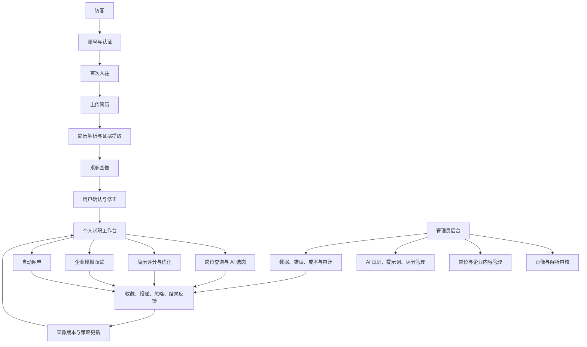
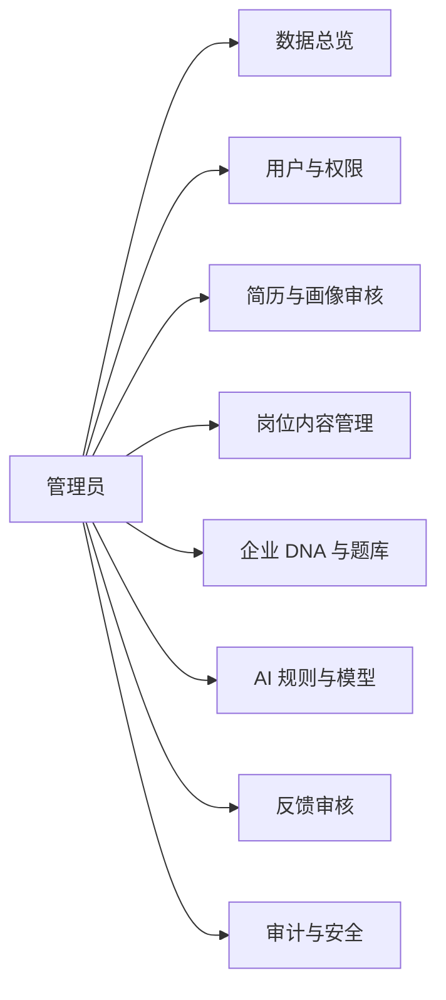
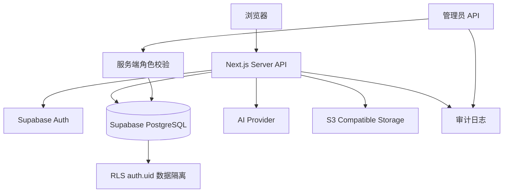

# Rising Path 系统蓝图

## 一句话定位

Rising Path 是一个以简历为入口、以求职画像为核心、以岗位匹配和行动反馈为闭环的留学生求职操作系统。

用户不需要分别学习“找岗位、改简历、模拟面试、自动网申”四套工具。用户只需要建立一次可信的求职画像，后续所有功能都围绕这份画像协同工作。

## 总体结构



## 产品主线

```text
上传简历
  -> 提取证据
  -> 生成求职画像
  -> 用户确认画像
  -> 选择目标岗位或方向
  -> 评分与推荐
  -> 优化简历/练习面试/准备网申
  -> 投递并记录结果
  -> 根据结果更新策略
```

核心原则是：画像确认后，所有 AI 功能必须读取同一套上下文；任何功能产生的结果都应该能够解释“使用了哪些画像信息、为什么得出这个结论”。

## 用户端体验

### 1. 首次入驻

登录后不要先展示复杂的功能菜单，而是给用户一个明确的第一步：上传简历。

入驻流程：

1. 上传 PDF、DOCX 或已有简历文件。
2. 显示解析进度，不让用户面对空白等待。
3. 提取教育、实习、项目、技能、语言、地区、毕业时间和求职目标。
4. 展示系统生成的求职画像。
5. 用户确认或修改关键字段。
6. 生成三个最值得执行的下一步行动。

### 2. 求职画像确认

画像确认页是产品的核心页面，至少要展示：

- 目标职位和目标行业
- 目标地区、城市、语言和工作权限
- 当前求职阶段
- 学历、院校背景、毕业时间和专业匹配度
- 实习、项目和工作经历质量
- 技能、语言和证书
- 用户优势
- 当前短板
- 推荐的简历策略和面试策略

用户可以修改画像，但不能直接修改原始简历证据。修改后的字段保存到 `segmentation_overrides` 或独立的画像版本中，并记录修改来源。

### 3. 个人求职工作台

工作台不应该只是统计面板，而应该告诉用户：

- 我现在处于什么阶段？
- 我今天最值得做什么？
- 做完这一步后下一步是什么？

建议的首页行动卡：

```text
优先投递：最匹配的 3 个岗位
简历提升：当前版本最影响通过率的 2 个问题
面试准备：下一场目标公司的高风险追问
```

## 核心画像引擎

求职画像分为三层，不要把它简单理解成一堆字段。

| 层级 | 内容 | 作用 |
|---|---|---|
| 证据层 | 简历原文、经历条目、可引用的项目和成果 | 让 AI 结论可追溯 |
| 结构层 | 教育、实习、项目、技能、地区、语言、时间等标准字段 | 供搜索、匹配和网申使用 |
| 策略层 | 求职阶段、竞争力、方向优先级、短板和地区策略 | 驱动优化、面试和行动推荐 |

建议的画像对象：

```text
CareerProfile
├── identity
├── education
├── experience
├── projects
├── skills
├── languages
├── workAuthorization
├── targetRoles
├── targetRegions
├── careerStage
├── strengths
├── gaps
├── strategy
└── confidence
```

每个重要判断都应尽量带有：

```text
字段值 + 来源证据 + 置信度 + 是否被用户确认 + 画像版本
```

当前数据库中的 `resumes.profile`、`segmentation`、`segmentation_overrides` 和 `segmentation_confirmed` 可以作为第一版实现基础。

## 四个核心功能如何协同

### 岗位查询与 AI 选岗

输出不应只有一个匹配分数，而应包括：

- 匹配分数
- 匹配证据
- 关键差距
- 是否建议投递
- 应该使用哪一版简历
- 投递前必须补齐的内容

同一用户投产品经理、商业分析和市场岗位时，评分结果应该不同，因为目标岗位是评分标准的一部分。

### 简历评分与优化

正确链路是：

```text
原始简历 + 用户画像 + 目标岗位
  -> 初始评分
  -> 针对性优化
  -> 生成新版本
  -> 新版本重新评分
```

建议拆成以下维度：

- ATS 结构与可解析性
- 岗位关键词匹配
- 经历与岗位要求匹配
- 成果量化程度
- 证据强度和可信度
- 地区表达策略
- 用户画像适配度

不要给简历永久固定分数。评分必须绑定目标岗位和画像版本。

推荐增加 `resume_score_snapshots`，保存每次评分的岗位、画像版本、维度分数、建议和时间。

### 企业模拟面试

面试策略应由三部分共同决定：

```text
面试策略 = 企业面试 DNA + 目标岗位要求 + 用户求职画像
```

面试官性格不应完全随机，而应来自企业 DNA 和面试轮次：

- 友好引导型
- 结构化追问型
- 压力验证型
- 业务深挖型
- 技术细节型
- 结果导向型

不同用户也应有不同追问：

- 应届生：潜力、学习能力、基础能力
- 转专业用户：动机和能力迁移
- 实习经历较弱：贡献边界和成果真实性
- 海外求职者：跨文化沟通、签证和地区适配

现有 `company_dna`、`interview_sessions`、`interview_feedback` 已经提供了较好的数据基础。

### 自动网申

网申字段应该来自结构化画像，但每次提交前都让用户确认：

- 本次使用了哪些字段
- 哪些字段是 AI 推测的
- 哪些字段需要用户手动确认
- 哪些字段不能自动填写

自动网申的目标不是“完全不让用户看”，而是“减少重复劳动，同时保留最终控制权”。

## 管理员后台

管理员后台是控制中心，不是用户端的复制品。



第一版管理员后台优先包含：

1. 数据总览：注册、验证、活跃、上传、匹配、面试、投递和错误率。
2. 用户管理：搜索、验证状态、账号禁用/恢复、删除申请和角色权限。
3. 简历画像审核：解析失败重试、置信度低的字段、人工修正和版本查看。
4. 岗位管理：导入、去重、编辑、上下架和失效岗位清理。
5. 企业 DNA：查看、编辑、版本、来源和反馈关联。
6. 反馈审核：低真实度面试、低质量匹配和异常优化结果。
7. 审计日志：谁在什么时候修改了什么内容。

权限建议：

```text
super_admin   系统设置、管理员、删除操作
content_admin 岗位、企业 DNA、面试题库
ai_reviewer   画像、评分、AI 结果和反馈审核
support_admin 用户状态和认证问题处理
```

管理员 API 必须在服务端验证角色，不能依赖前端隐藏按钮。简历、邮箱、签证等隐私信息默认脱敏，密码和 OAuth 凭据永远不可见。

## 数据与安全边界



必须坚持：

- 后端从 Bearer token 获取用户身份，不能信任客户端传入的 `user_id`。
- 用户数据通过 `user_id` 和 PostgreSQL RLS 双重隔离。
- 管理员操作走独立的服务端权限检查。
- 简历、匹配、面试报告和 AI 输出都要记录用户和版本。
- 删除、改画像、改企业 DNA 等高风险操作必须二次确认并记审计日志。

## 当前版本与目标版本

### 当前已经具备

- Supabase Auth、邮箱密码、邮箱验证码和注册验证流程
- Google OAuth 基础流程
- 用户级数据隔离和认证 API
- 简历、岗位、网申、AI 匹配和面试相关数据模型
- 企业面试 DNA 和真实度反馈模型
- 登录页注册成功 Lanyard 3D 弹窗
- 3D 渲染排障文档和 WebGL 稳定性修复

### 当前最重要的缺口

- 首次上传简历后的完整入驻向导
- 求职画像确认页的统一交互
- 画像版本和证据引用
- 绑定目标岗位的简历评分快照
- 优化前后版本对比
- 管理员角色表、管理员路由和审计日志
- 统一的工作台行动推荐
- 用户行为反馈驱动的画像更新

## 实施计划

### 阶段一：建立统一画像入口

- 完成上传简历后的解析状态页。
- 统一教育、经历、项目、技能、方向和地区字段。
- 完成画像确认卡片和手动修正。
- 保存 `segmentation_confirmed` 和画像版本。
- 画像未确认前，允许浏览，但不要给出最终推荐结论。

### 阶段二：让画像驱动现有功能

- 岗位匹配接入画像和地区规则。
- 简历评分绑定目标岗位。
- 简历优化使用画像、岗位和地区上下文。
- 面试使用企业 DNA、岗位要求和用户画像。
- 网申字段读取画像并保留人工确认。

### 阶段三：建立反馈闭环

- 记录收藏、忽略、投递和面试结果。
- 保存简历评分和优化版本快照。
- 把面试短板转化为简历和练习任务。
- 让用户确认后才更新核心画像。
- 展示画像变化和求职策略变化。

### 阶段四：建立管理员控制中心

- 数据总览。
- 用户和权限管理。
- 简历解析与画像审核。
- 岗位和企业 DNA 管理。
- AI 结果抽查、反馈审核和审计日志。
- 邮件、认证、模型和功能开关监控。

## 每个阶段的完成标准

功能完成不等于页面能打开。每个阶段都必须满足：

- 用户知道当前系统正在做什么。
- AI 结论能说明依据。
- 失败时能重试或人工修正。
- 用户可以控制和修改关键结果。
- 后端 API 有身份校验和数据隔离。
- 关键数据有版本和来源。
- 管理员能查到异常原因。
- 不能用永久固定分数代表不同岗位的适配度。

## 最终产品体验

用户每次打开系统，都应该得到三个清晰答案：

1. 系统现在如何理解我的背景？
2. 我当前最值得申请或准备什么？
3. 完成这一步后，下一步是什么？

Rising Path 的高级感不应该来自功能数量，而应该来自持续一致的上下文：系统记得用户是谁，理解用户的目标，解释每个建议，并且让所有功能共同推进同一条求职路径。
